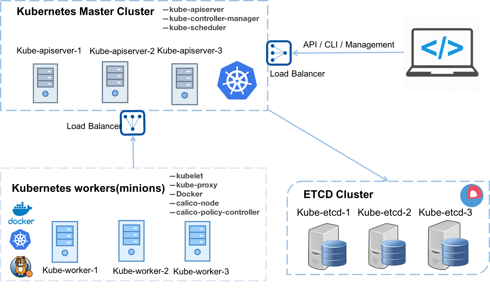

---?image=images/kubernetes.png&size=auto
@title[Inicio]

---
---?image=images/kubespray-logo.png&size=auto
@title[Kubespray]

---
@title[Introducción Kubespray]
## ¿Qué es Kubespray?

Es un proyecto Open Source que permite implementar un cluster de kubernetes en Bare Metal, AWS, GCE y OS, el cual es una composición de PlayBook's de Ansible, inventario, herramientas de aprovisionamiento y conocimiento de tareas de administración de configuración de clústeres OS/Kubernetes genéricos.

---
@title[Soporte Kubespray]

**Kubespray** tiene soporte para las siguientes versiones de sistema operativo:

Container Linux by CoreOS
Debian Jessie, Stretch, Wheezy
Ubuntu 16.04, 18.04
CentOS/RHEL 7
Fedora/CentOS Atomic
openSUSE Leap 42.3/Tumbleweed

---
@title[Infraestructura]
## Infraestructura Escalable

La plataforma de Cluster Kubernetes se implementara sobre infraestructura **VMWare** y se deplegara de la siguiente forma:

3 Nodos Etcd (https://kubernetes.io/docs/setup/cluster-large/#etcd-storage)
4 Nodos Master (https://kubernetes.io/docs/setup/cluster-large/#size-of-master-and-master-components)
N+1 Nodos Worker
1 Nodo de Deployment (Administración)

 

+++
@title[Kuberntes - VMWare]

Para lograr el correcto funcionamiento entre **Kubernetes** y **VMWare**, es necesario cumplir con algunos requisitos de privilegios sobre el **vCenter**, los cuales para nuestro caso son:

+++
@title[Lista Privilegios]

| Roles | Privileges | Entities | Propagate to Children |
|---|---|---|---|
|manage-k8s-node-vms |	VirtualMachine.Config.AddExistingDisk, VirtualMachine.Config.AddNewDisk, VirtualMachine.Config.AddRemoveDevice, VirtualMachine.Config.RemoveDisk | VM Folder | Yes |
| manage-k8s-volumes | Datastore.AllocateSpace, Datastore.FileManagement (Low level file operations) | Datastore | No |
| Read-only (pre-existing default role) | System.Anonymous, System.Read, System.View | vCenter, Datacenter, Datastore Cluster, Datastore Storage Folder, Cluster, Hosts | No |

+++
@title[Especificación]

Para poder impactar esto sin afectar otras entidades al interior del **vCenter**, es que se gestionaran estos permisos sobre un **Datacenter** propio y con una cuenta de servicio asociada.

La documentación oficial de este plugins esta en el siguiente repositorio:

https://vmware.github.io/vsphere-storage-for-kubernetes/documentation/index.html

---
@title[Prerequisitos]
### Instalación Kubectl Windows (chocolatey)

+++
@title[Rol-Deploy]
### Servidor Rol Deploy

- **Versión de Sistema Operativo:** CentOS Linux release 7.5.1804 (Core)
- **Disco Sistema Operativo:** 10 GiB
- **Disco para Herramientas de Deploy:** 5GiB
- **Area de Intercambio SWAP:** Desabilitado
- **Versión de Python:** 2.7.5-68 ó superior
	- **Versión de Ansible:** 2.6.3
	- **Versión de pip:** 19.0.3
	- **Versión de pyvmomi:** 6.7.0.2018.9
	- **Versión de Jinja2:** 2.9.6 ó superior
	- **Versión de netaddr:** 0.7.19 ó superior
	- **Versión de pbr:** 1.6 ó superior
	- **Versión de hvac:** 0.7.2

+++
@title[Rol-etcd]
### Servidores Rol Etcd

- **Versión de Sistema Operativo:** CentOS Linux release 7.5.1804 (Core)
- **Disco Sistema Operativo:** 10 GiB
- **Disco para Docker:** 10GiB ó superior
- **Area de Intercambio SWAP:** Desabilitado
- **vCPU:** 2
- **Memoria GiB:** 4 GiB
- **Red de Interconnect:** Exclusiva para Calico y Etcd
- **Referencias:** https://github.com/etcd-io/etcd/blob/master/Documentation/op-guide/hardware.md#hardware-recommendations

+++
@title[Rol-Master]
### Servidores Rol Master

- **Versión de Sistema Operativo:** CentOS Linux release 7.5.1804 (Core)
- **Disco Sistema Operativo:** 10 GiB
- **Disco para Docker:** 10GiB ó superior
- **Area de Intercambio SWAP:** Desabilitado
- **vCPU:** 4
- **Memoria GiB:** 8 GiB
- **Red de Interconnect:** Exclusiva para Calico y Etcd
- **Referencias:** https://kubernetes.io/docs/setup/cluster-large/#size-of-master-and-master-components

+++
@title[Rol-Worker]
### Servidores de Worker

- **Versión de Sistema Operativo:** CentOS Linux release 7.5.1804 (Core)
- **Disco Sistema Operativo:** 10 GiB
- **Disco para Docker:** 10GiB ó superior dependiendo del requerimiento
- **Area de Intercambio SWAP:** Desabilitado
- **vCPU:** 2 ó superior dependiendo del requerimiento
- **Memoria GiB:** 4 GiB ó superior dependiendo del requerimiento
- **Red de Interconnect:** Exclusiva para Calico y Etcd
- **Referencias:** https://kubernetes.io/docs/tasks/administer-cluster/reserve-compute-resources/#example-scenario

---
@title[Gracias]

# GRACIAS