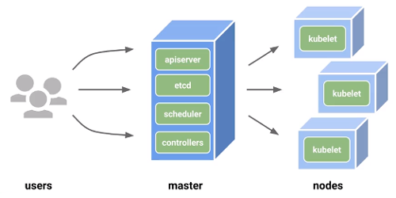

---?image=images/kubernetes.png&size=auto 40%
@title[Inicio]

---
@title[Introducción Kubernetes]
## ¿Qué es Kubernetes?

También conocido como **k8s**, es una plataforma Open-Source que permite la administración de contenedores (orquestador).
 
Se encarga del despliegue, la mantención y la escalabilidad de las aplicaciones.

---
@title[Historia]

Desarrollado originalmente por Google en 2014 y liberado en el 2015 para la Cloud Native Computing Foundation es actualmente utilizado por grandes compañías como **Redhat**, **IBM**, **CoreOS**, **SAP** entre otras.

---
@title[Infraestructura]
## Infraestructura

La infraestructura base del cluster de Kubernetes se compone de un servidor principal Master y sus Nodos (Workers).

---
@title[Master]
## Master

Sus componentes principales son `etcd`, `APIServer`, `Scheduler`, `Controller-Manager`.
Estos componentes toman decisiones sobre el cluster 

+++
@title[etcd]
## Etcd

Etcd se utiliza como almacén de respaldo de Kubernetes para todos los datos de cluster.
Su formato llave/valor permite que los componentes estén al tanto de cualquier cambio en el cluster.

+++
@title[APIServer]
## APIServer

Valida y configura datos para Pods, Services, ReplicaSets, entre otros.

+++
@title[Scheduler]
## Scheduler

Determina en qué nodo alojar un pod y sincroniza su información con la configuración del servicio.
Estas desiciones son tomadas en base a:

- Recursos del nodo |
- Restricciones de Hardware |
- Restricciones de software |
- Interferencia entre carga de trabajo |

+++
@title[Controller-Manager]
## Controller-Manager

El administrador de controlador de Kubernetes es un daemon (Servicio) que integra los bucles (secuencia repetida) de control central enviados con Kubernetes.

---
@title[Nodes]
## Nodes (Workers)

Son servidores que alojan los despliegues de aplicación. Son administrados por el servidor Master.
Se componen de los servicios `kubelet`, `container runtime` y `proxy`.

+++
@title[Kubelet]
## Kubelet

Verifica que los contendores que forman parte del POD estén en ejecución.
Solo administra contenedores creados por Kubernetes.

+++
@title[Container runtime]
## Container Runtime

Su función es ejecutar contenedores (Docker) y administrar sus imágenes.

+++
@title[Proxy]
## Proxy

Se encarga de realizar `forwarding` de conexiones TCP o UDP para exponer Services o PODs.

---
@title[Info]

Más información sobre [Conceptos Kubernetes](https://kubernetes.io/docs/concepts/)

---
@title[Práctica1]
# Práctica Despliegue MySql

- Crear Namespace |
- Crear Secret |
- Crear PersistentVolumeClaim |
- Crear Deployment |
- Crear Service |

---
@title[Práctica2]
# Práctica Despliegue Wordpress

- Crear PersistentVolumeClaim |
- Crear Deployment |
- Crear Service |
- Crear Ingress |

---
@title[Gracias]

# GRACIAS
